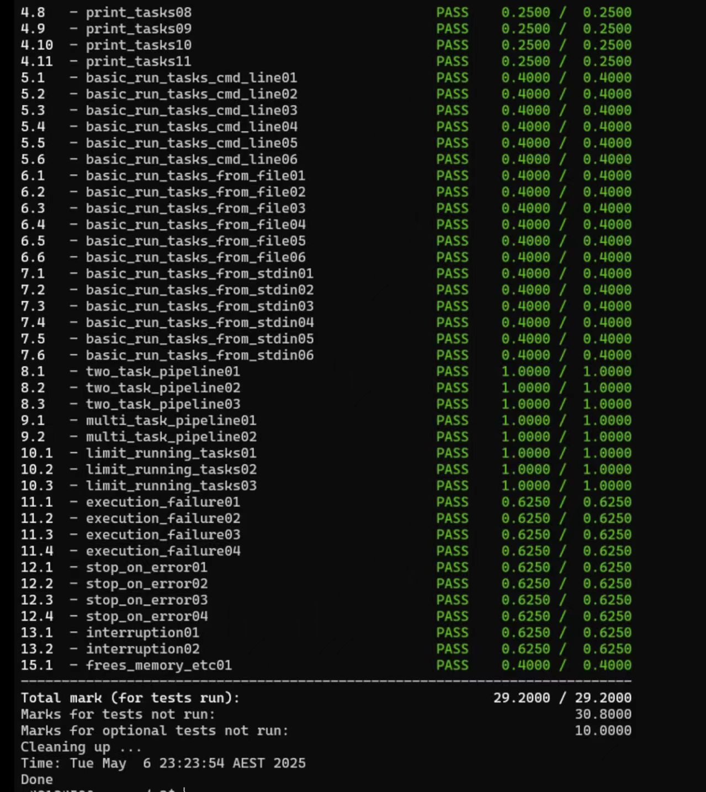

<!-- GitHub banner / 微信二维码区域 -->
<p align="center">
  
  
</p>

<h1 align="center">🔥 6年全栈工程师 | 留学生编程导师 | 800+无差评</h1>

<p align="center">
  <em>🚀 Helping CS international students ace their assignments, projects, and careers.</em>
</p>

---

# uqparallel: Parallel Task Executor (CSSE2310 Assignment 3)

🚀 This repository presents the high-level design and feature implementation for **CSSE2310 Assignment 3**, a C-based utility named `uqparallel` inspired by `GNU parallel`. It focuses on process management, UNIX signal handling, and command line parsing.

> ❗ **Note:** No source code is shared to maintain academic integrity. If you need conceptual help or guidance debugging your implementation, feel free to get in touch.

---

## 🧠 Project Overview

`uqparallel` is a custom parallel task runner designed to execute multiple shell commands simultaneously with control over concurrency, pipelines, and execution behavior. It implements features such as:

- 🧵 **Parallel Execution** with a limit (`--joblimit`) on concurrent tasks
- 💥 **Abort on Error** with signal-based task termination (`--abort-on-error`)
- 📤 **Pipeline Support** (`--pipeline`) for chaining commands
- 📋 **Dry-run Output** (`--dry-run`) for task inspection
- 📂 **Argument Sources** from CLI, stdin, or `--argsfile`
- 🔐 Robust **resource cleanup**, child reaping, and signal-safe behavior
- 🧼 **No busy waiting**, zombie processes, or unwanted file descriptors

Key implementation constraints include:
- ❌ No `goto`, `system()`, `sleep()`, or `popen()`
- 🔒 At most **one global variable** (bool type)
- 📎 Style-compliant and memory-leak free (`valgrind` safe)

---

## ✅ Features Demonstrated

- [x] Argument parsing with usage error handling
- [x] Task scheduling with concurrency caps
- [x] Pipeline setup using `pipe()` and `dup2()`
- [x] Signal-based error propagation and exit control
- [x] SIGINT handling with proper shutdown
- [x] Memory cleanup and file descriptor management

### Example Commands

```bash
./uqparallel ls -a ::: /etc /usr
./uqparallel --argsfile one wc /etc/motd
./uqparallel --pipeline --argsfile two
./uqparallel --joblimit 1 ::: whoami uname uptime
```

All stages passed successfully. Below is a screenshot as proof:



---

## 💬 Need Help?

If you're working on `uqparallel` and stuck on pipeline construction, job limits, or signal handling, I can help explain the logic and debug issues.

📱 **WeChat: `coder199608`**

*No code sharing — only architectural guidance and debugging help.*

---

## ⚠️ Disclaimer

This repository contains **no code** and is solely for sharing implementation insights. Sharing assignment solutions violates UQ’s academic integrity policy.

---

## 📚 Tags

`C` `CSSE2310` `uqparallel` `Process Control` `Signals` `Pipes` `Concurrency` `Task Scheduler`
